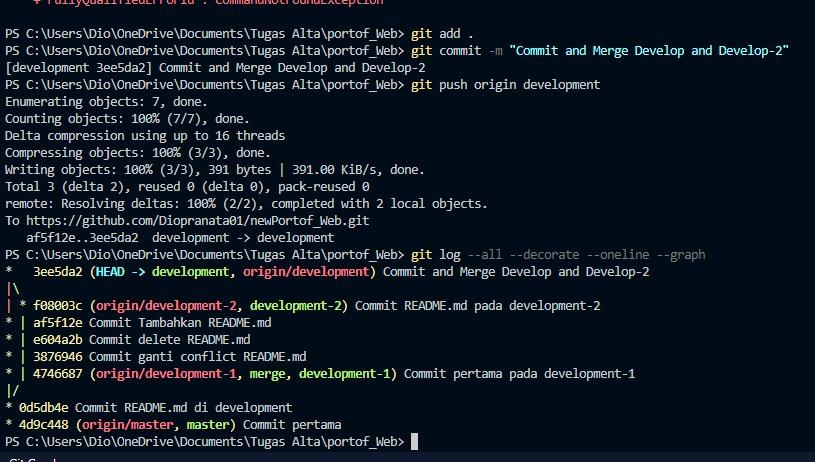
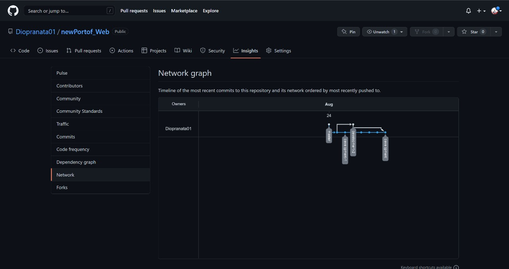

# KM React - Version Control and Branch Management (GIT)

## Resume
Pada materi ini, mempelajari tentang beberapa hal berikut :
1. Pengenalan serta fundamental dalam Versioning Control
2. Penggunaan dan implementasi Git
3. Penggunaan dan implementasi Github

### Proses Versioning Control
### a. Pada Github
1. Pengguna dapat langsung membuat repository pada laman web Github.com, kemudian dapat memilih untuk menghubungkan
repository dengan Git pada lokal atau tidak, kemudian dapat menambah file yang diinginkan, hingga mengeditnya tanpa
tersambung git.

### b. Pada Git
1. Sama seperti Github, git dapat menambahkan hingga melakukan versioning control secara lokal meskipun tidak
terhubung dengan Github

### c. Pada Git tersambung dengan Github
1. Pembuatan Repository sangat dipermudah dengan terhubungnya Git dan Github, dapat menambahkan isi dari Repository
melalui lokal Git, kemudian mengubah, menambahkan workspace (branch) baru untuk development, hingga menyatukan
kembali workspace (branch) menggunakan CLI dengan prompt "git <add>" hingga "git <merge> <branch>".

## Task 
### Membuat Repository Baru Github & Mini Project
1. Membuat Repository, kemudian master branch, development, development 1, hingga development 2 branch, dimana development
branch akan di satukan dengan development 1, dan development 2, setelah melakukan perubahan pada masing"branch.

Berikut kode hasil dari praktikum .
[..]

Berikut link Repository .
https://github.com/Diopranata01/newPortof_Web / https://github.com/Diopranata01/newPortof_Web.git

Hasil Task dapat dilihat pada .

