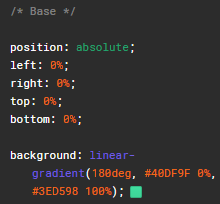
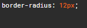
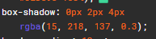
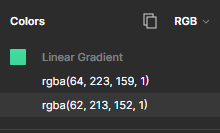

# Figma

## Resume
Pada materi ini, mempelajari tentang beberapa hal berikut :
1. Pengenalan kepada Tools Figma
2. Penggunaan dan implementasi Figma dalam css
3. Pengenalan component, grouping, dan implementasi

### Proses Pembuatan Elemen pada Figma
### a. Di awali dengan menggunakan framework dan memilih atau membuat ukuran untuk sketch
sesuai keinginan.

### b. Dilanjutkan dengan komponen lainnya yang diinginkan, kemudian dapat di ubah, di atur serta, dapat dijadikan beberapa komponen sesuai yang di inginkan.

### c. Pembuatan sebuah elemen, memiliki banyak fitur, dimana antara componen berupa shape, ataupun frame, memiliki perbedaan nya masing - masing. Masing - masing komponen dapat disesuaikan seperti jenis background, warna background, kemudian di imbuhkan componen lain seperti text, text dapat di ubah bentuk, font, warna, hingga baris.

## Task 
### Melakukan analisis untuk contoh kode figma
1. Menganalisis componen "button" yang terdapat pada link, dimana terdapat beberapa bagian lain yang di analisis, yaitu :
a. Warna Dalam Satuan RGB.
b. Shadow
c. Background
d. Box-shadow
e. Border-radius

2. Melakukan analisis pada Komponen Card, dan beberapa komponen didalamnya seperti
berikut :
a. Widht
b. Height
c. Radius

Hasil Task dapat dilihat pada .

