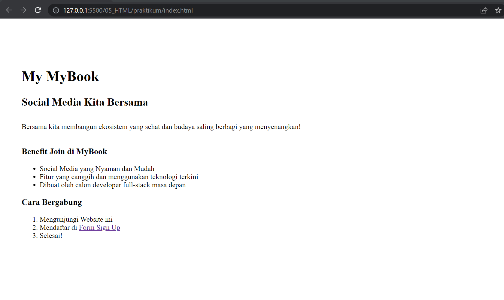
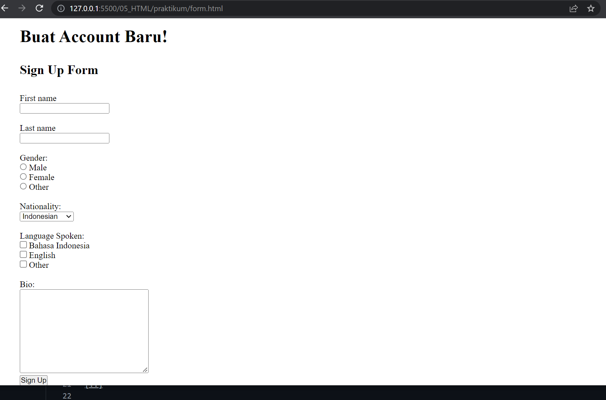
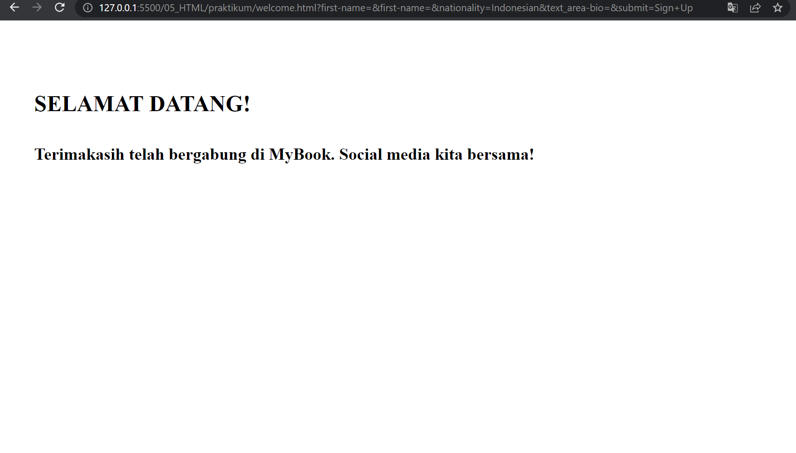

# KM React - Version Control and Branch Management (GIT)

## Resume
Pada materi ini, mempelajari tentang beberapa hal berikut :
1. Pengenalan serta fundamental dalam HTML
2. Penggunaan dan implementasi HTML
3. Srtuktur utama dalam file HTML

### HTML
### 
1. Dalam pembuatan file HTML, terdapat beberapa struktur utama yang disebut HTML tag, berfungsi sebagai aturan awal pada penulisan HTML 5.
2. Kemudian 5 tag tersebut ialah DOCTYPE, tag HTML, kemudian tag Head sebagai informasi dalam file, dan tag Body, serta tag Div, dan tag Heading.
3. Terdapat elemen lain dalam HTML, seperti list serta unordered list

## Task 
### Membuat Repository Baru Github & Mini Project
1. Membuat web site sesuai arahan pada task yang ada, yaitu membuat 3 buah page halaman, dimana tiap page atau halamanya berisikan beberapa konten, mencakup tag HTML yang disebutkan diatas tadi, serta kegunaanya masing - masing.

Hasil Task dapat dilihat pada .

