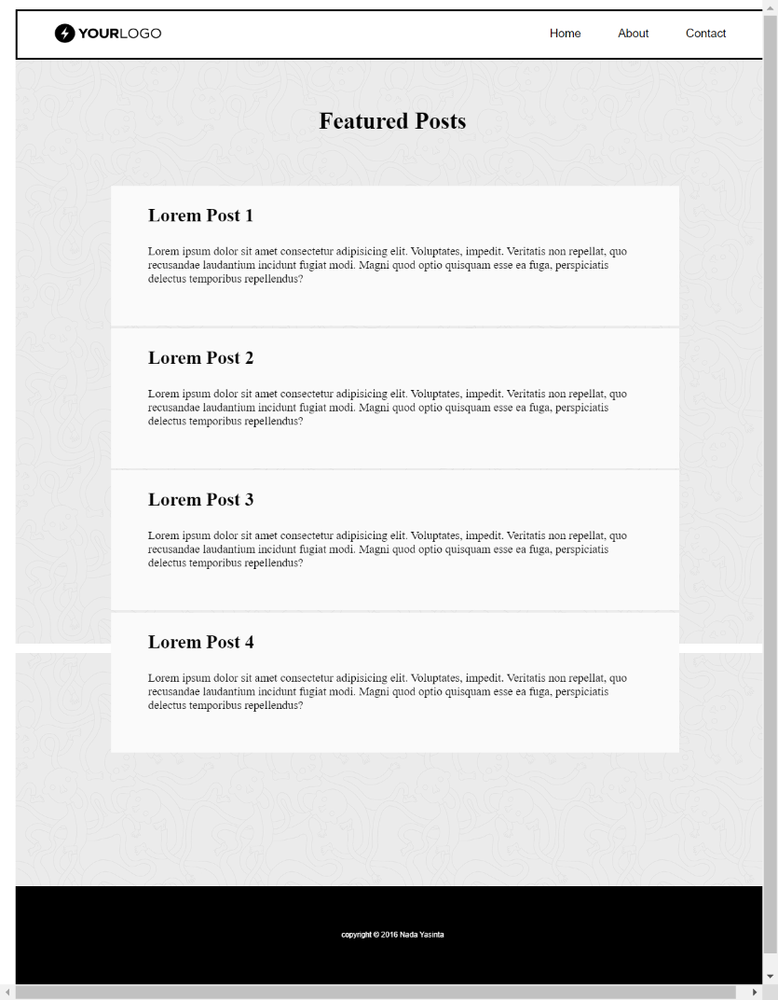

# CSS

## Resume
Pada materi ini, mempelajari tentang beberapa hal berikut :
1. Pengenalan serta fundamental dalam CSS
2. Penggunaan dan implementasi CSS
3. Srtuktur utama dalam CSS serta selector, hover, dan lainnya

### CSS
1. Dalam pembuatan css, memiliki syntax yaitu selector (tag dalam html), kemudian curly brashes {}, dan didalamnya dilanjutkan dengan property serta value dari property tersebut.
2. Penanda HTML dalam css, dapat digunakan selector ID dan Class, untuk ID menggunakan #, dan Class (.).
3. Kemudian, terdapat Framework sebuah Css yaitu Bootstrap, dalam framework ini terdapat class yang berisi beberapa property, serta memudahkan dalam mengedit dan memodifikasi css.

## Task 
1. Ubahlah tampilan dari file1.html sehingga menjadi seperti ini, ketentuan ,gunakan font-family Slabo 27px, serif, dan font-size 20px.
2. Buatlah sebuah file dengan nama file2.html dengan desain seperti berikut, dibagian header kalian diberi kebebasan untuk memperbaiki bentuk dan responsive, dengan konten yang terdapat masih tetap sama.

Hasil Task dapat dilihat pada .

