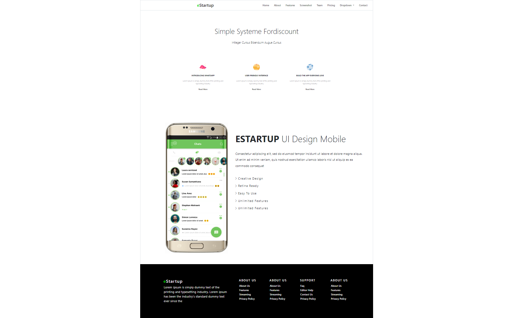

# CSS

## Resume
Pada materi ini, mempelajari tentang beberapa hal berikut :
1. Pengenalan pada framework bootsrap
2. Penggunaan dan implementasi bootstrap
3. Srtuktur dalam penggunaan bootstrap

### Bootstrap
1. Pada framework CSS ini, terdapat beberapa elemen yang dapat digunakan untuk membangun sebuah kopmonen untuk membangun css lebih cepat
serta menggunakan template yang memudahkan dalam bekerja.
2. Terdapat 5beberapa kemudahan dalam penggunaan framework CSS ini, misalkan saat kita ingin menciptakan sebuah foto yang berisi bingkai, ataupun
terlhihat persis seperti elemen "card", maka framework sangat membantu dalam membangun CSS lebih mudah dari sebelumnya.
3. Kemudahan yang didapat, dapat disesuaikan dengan kebutuhan, dimana elemen - elemen yang kita gunakan dapat diubah, di sesuaikan dengan kebutuhan 
kita sebagai pengelola

## Task 
1. Buatlah header yang responsive dengan bentuk sebagai berikut .
2. Buatlah Body berikut .
3. Untuk folder buatlah seperti berikut

Hasil Task dapat dilihat pada .

