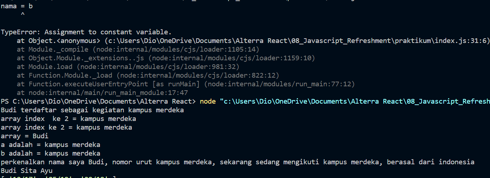
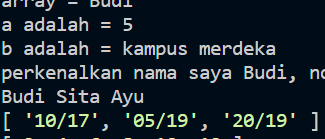

# Javascript Refreshment

## Resume
Pada materi ini, mempelajari tentang beberapa hal berikut :
1. Pengenalan pada kembali pada Javascript
2. Beberapa hal tentang Js seperti Variabel, Method, Destrcuturing, Spread sheet, dan lain - lain
3. Penting untuk tetap membedakan scoop dari sebuah code, global, function.

### Javascript
1. Pada materi Javascript Refreshment kali ini, saya kembali mempelajari Js mulai dari bagaimana tipe - tipe yang ada, mengenal variabel dimana ES5 terdapat Let, dan ES6 terapat Const, memiliki masing - masing fungsi, diluar fungsi dan method yang ada.

2. Destructuring sebuah array ataupun object sangat diperlukan, dimana 2 hal ini dapat dikatakan memiliki struktur yang berbeda, baik hingga kedepan nantinya saat penggunaan React.

3. Scoop yang tidak kalah penting menurut saya, dimana seberapapun logika kita dalam mengolah sebuah Javascript code, akan sangat ceroboh jika melupakan hal kecil yang penting seperti scooping ini, yang kadang saya sering melakukanya.

## Task 

Hasil Task dapat dilihat pada .

