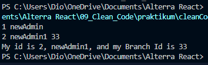

# Clean_Code

## Resume
Pada materi ini, mempelajari tentang beberapa hal berikut :
1. Pengenalan pada materi clean_code
2. Bagaimana penggunaan clean_code
3. Penulisan pada jenis class, serta inheritnya, kemudian constructor, etc 

### Clean_Code
1. Pada materi Clean Code pada Javascript, serta karakteristik clean code yang  berjumlah 9 jenis.

2. Mengenai KISS yaitu Keep It So Simple, pengertian nya adalah menghindari membuat fungsi yang dibuat untuk melakukan a, kemudian modifikasi suatu b, dst saling berhubungan.

3. Kemudian ada DRY, yaitu Dont Repeat Yourself, menduplikasi code secara terus menerus, dapat menimbulkan Repeated Code didalam codingan tersebut, kemudian penggunaan fungsi akan membantu untuk tidak mengulang dan menimbulkan Repeated Code tersebut.

## Task 

Hasil Task dapat dilihat pada .

