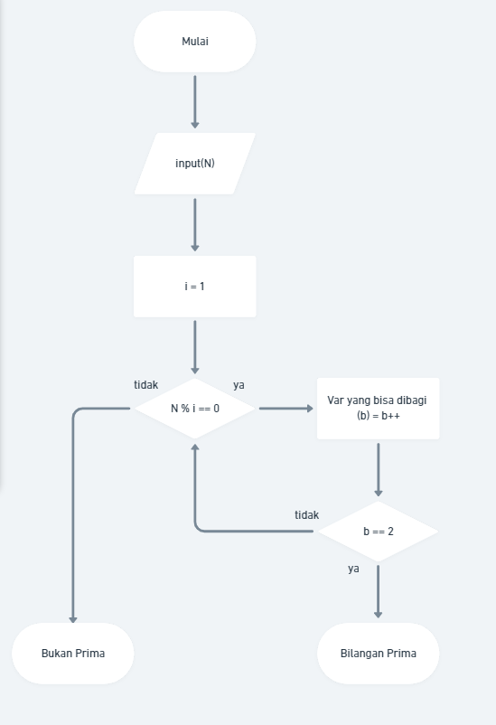
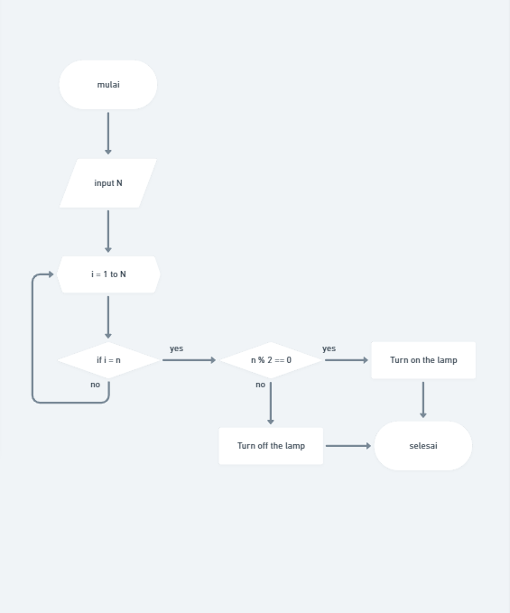

# Praktikum_Putu-Bagus-Dio

## Soal

### Problem 1
### Dalam matematika, bilangan prima adalah bilangan asli yang lebih besar dari angka 1, yang faktor pembaginya adalah 1 dan bilangan itu sendiri. 2 dan 3 adalah bilangan prima. 4 bukan bilangan prima karena 4 bisa dibagi 2. Kamu diminta untuk membuat fungsi untuk menentukan bahwa sebuah bilangan termasuk bilangan prima atau tidak.

### 2. Terdapat N tombol yang dinomori dari 1 hingga N dan sebuah lampu dalam keadaan mati. Apabila tombol ke-i ditekan, keadaan lampu akan berubah (dari mati menjadi menyala, atau sebaliknya) jika N habis dibagi oleh i. Apabila masing-masing tombol ditekan tepat sekali, 
bagaimana keadaan lampu pada akhirnya?

## Jawab

### 1. Pada problem nomor 1 ini, terdapat permasalahan sebuah bilangan Prima, dimana algoritma dari permasalahan tersebut dibutuhkan, kemudian Bilangan Prima sendiri merupakan sebuah bilangan yang hanya habis dibagi oleh 1, dan bilangan tersebut. Jadi ada 2 hasil pembagi (modulo=0) bagi bilangan tersebut, dan dinyatakan bilangan prima. Untuk algoritma problem 1 sendiri ialah dengan memulai kemudian input user pada variable n, kemudian dilakukan perulangan i = 1, dimana i akan langsung bernilai 1, kemudian nilai n akan dibagi i (1), dan jika modulo = 0, var 'pembagi' nilainya akan bertambah, dan i ++, kemudian kembali di modulo dengan n input, jika modulo tidak samadengan 0, var 'pembagi' tidak akan bertambah, dan jika var pembagi bernilai == 2, input n akan dinyatakan sebagai bilangan prima. Jika tidak == 2, atau lebih, bukan bilangan prima.

### 2. Sama seperti problem 1, tombol dengan jumlah n, dimana masing - masing akan memiliki fungsi 'mematikan' atau 'menghigupkan' lampu dan bersifat habis jika dibagi dengan input user. Kemudian nput user akan dimasukan terlebih dahulu, masuk kedalam for loop jika i <= n , dan jika i = n, lakukan if nilai n jika di modulo 2 == 0, jika iya output lampu akan 'hidup', jika tidak == 0, lampu akan 'mati', dimana jika masing masing tombol akan memiliki value true dan false, selang tiap 2 tombol akan memiliki value yang sama hingga n, maka akan adil jika user menginput tombol yang di inginkan jika ia mengetahui tiap 2 tombol akan memiliki value yang sama.

