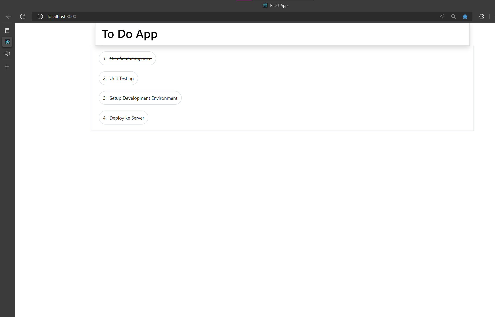

# Praktikum_Putu-Bagus-Dio

## Soal

### 1. Buatlah sebuah aplikasi daftar tugas (todo list). Daftar barang itu memiliki 3 field yakni id (number), name (string), dan completed (boolean). Apabila completed adalah “True” maka nama todo-nya akan tercoret. Berikut ini tampilan aplikasi setelah dibuat. Poin terpenting adalah teman - teman mampu melakukan komposisi komponen, implementasi list rendering & styling.

## Jawab

### 1. Pada soal ini, pembuatan aplikasi daftar tugas (todo list), di implementasikan dengan cara sebagai berikut, dimana perlu di ingat Data akan menggunakan useState, kemudian const dengan index toDoList diawal, kemudian setToDo sebagai perubahan yang akan dilakukan, dimana data tersebut memiliki beberapa field, seperti pertama yaitu uniqe key id, kemudian title, dan terakhir adalah status berisikan boolean. 

## Cara kerja

### Berikutnya setelah melakukan useState, maka langsung menggunakan function componen, me-return sebuah container, kemudian useState dengan param toDoList akan di cek kondisinya jika terisi dan bernilai true, maka tidak akan menampilkan apapun sebagai output, jika sebaliknya, 
 tag dengan pesan 'Belum ada Task...' akan dijalankan. Setelah mengecek, toDoList akan di map, dengan parameter toDO sebagai isi, kemudian index sebagai index dari perubahan pada useState, dimana var let digunakan untuk de-structuring dari toDo agar tidak lagi menuliskan <parameter.id>, dan dalam map tersebut me-return kembali dan berisikan komponen. Menggunakan id sebagai key awal dalam map untuk menampilkan tiap isi dari toDo, maka data akan di print sesuai dengan isi, lalu dilakukan pengecekan apakah toDo.status bersifat true or false, jika true maka dianggap sudah menyelesaikan tugas tersebut dan mencoretnya dengan memberikan sebuah class khusus, jika tidak maka akan diberikan clas biasa tanpa tanda coret dan mengartikan bahwa task tersebut belum selesai, dan bersifat false

## Hasil Task 
