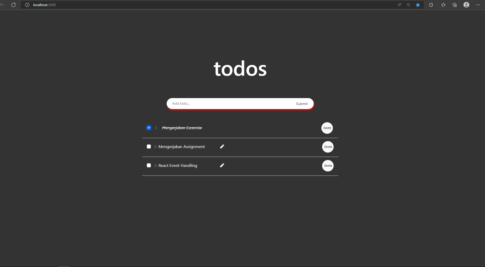

# Event_Handling

## Resume
Pada materi ini, mempelajari tentang beberapa hal berikut :
1. Pengenalan pada materi State, Handling Events
2. Bagaimana penggunaan State, Statefull dan stateless, kemudian Handling events.
3. Aplikasi serta pengertian akan event handling lebih lanjut

### Penjelasan
1. Pada materi Event handling, sebuah state adalah data yang bersifat private, dari component, kemudian hanya digunakan dan tidak digunakan untuk componen lainnya selain state itu sendiri.

2. Penggunaan setState untuk modifikasi data, kemudian setiap modifikasi akan terjadi render ulang data dimana dapat digunakan didalam sebuah class.

3. Perbedaan antara State dan Props, dimana sebuah state digunakan dalam class, kemudina bersifat asynchronous, di ubah menggunakan <this.>, sedangkan props adalah bersifa read-only, dan tidak dapat di modifikasi.

## Task 
### Buatlah daftar pekerjaan yang akan kamu kerjakan, dengan kriteria sebagai berikut :
### 1. Daftar pekerjaan dapat ditambahkan menggunakan inputan.
### 2. Terdapat checklist pada setiap daftar pekerjaan
### 3. Aktifkan chekslit jika pekerjaan selesai dikerjakan, seperti contoh dibawah
### 4. Sertakan tombol hapus untuk menghapus suatu pekerjaan dari daftar pekerjaan.
### 5. Apabila inputan yang anda submit tersebut kosong, tampilkan alert bahwa anda harus mengisi inputan tersebut terlebih dahulu sebelum anda submit

Hasil Task dapat dilihat pada .
