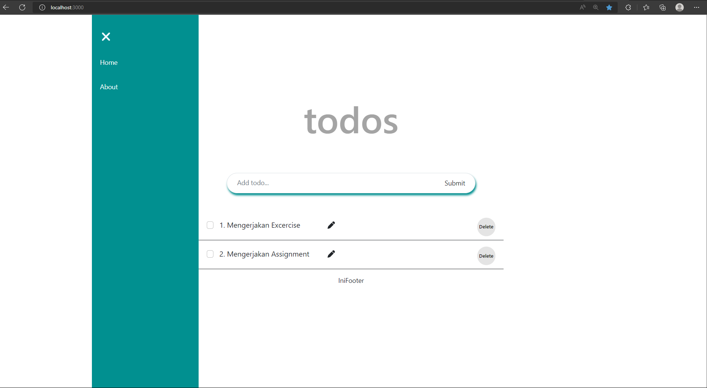
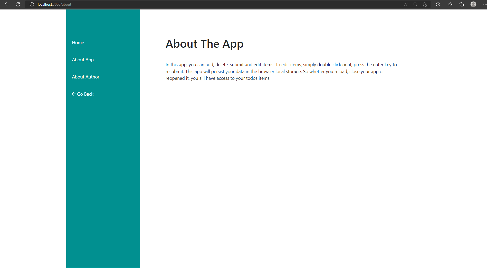
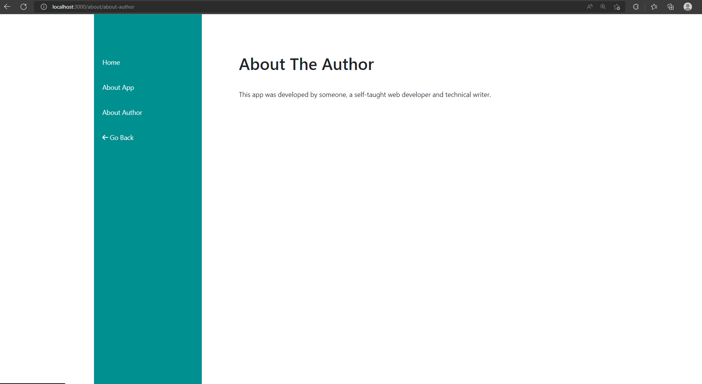
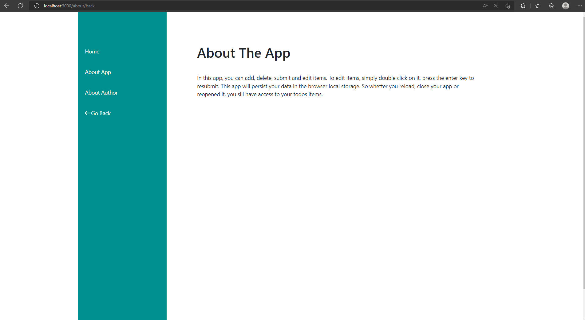

# React_Routing

## Resume
Pada materi ini, mempelajari tentang beberapa hal berikut :
1. Pengenalan pada materi React Routing
2. Bagaimana penggunaan React Routing pada aplikasinya dalam SPA (Single Page Aplication)
3. Aplikasi React Routing pada sebuah komponen.

### Penjelasan
1. Pada materi ini, yaitu React Rouing, dimana penggunaan Routing sendiri untuk menunjukan sebuah proses navigasi pada Single Page Application, dimana biasanya pada Multi Page Aplication menggunakan atribute html, dan langsung menunjukan navigasi berhasil menuju Page lainnya, sedangkan pada SPA menggunakan satu komponen, dan dapat merender komponen page lainnya, dan dapat mencocokan url pada props, penggunaan redirect, dan error massage jika keluaran menunjukan proses error.

2. Sebuah Multi Page Aplication biasa disebut dengan traditional web application, penggunaan MPA ini adalah metode lama dalam memunculkan hasil dari sebuah page atau halaman yang dituju, dimana akan melakukan render ulang keseluruhan dari halaman setiap new request dijalankan.

3. Terdapat komponen penting utama pada Route, yaitu Browser Route, Routes, dan Route, dan penggunaan nya harus menginstall terlebih dahulu dependencies nya, kemudian import dari 'react-rouer-dom'. Penggunaan Browser Route adlaah sebagai router yang menggunakan API History dari HTML5, dimana pencocokan menggunakan lokasi, terhadap UI dan url. 

## Task 

Hasil Task dapat dilihat pada .

