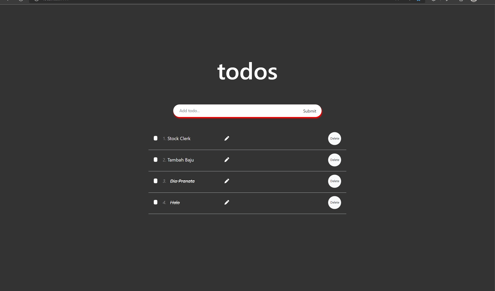
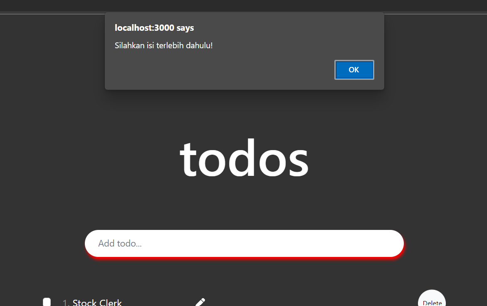
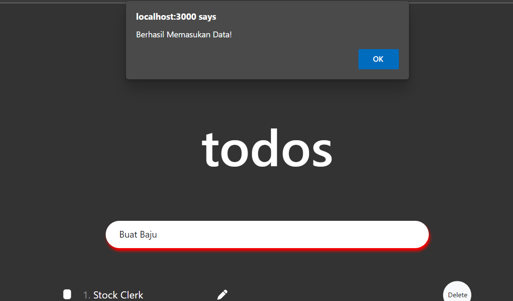
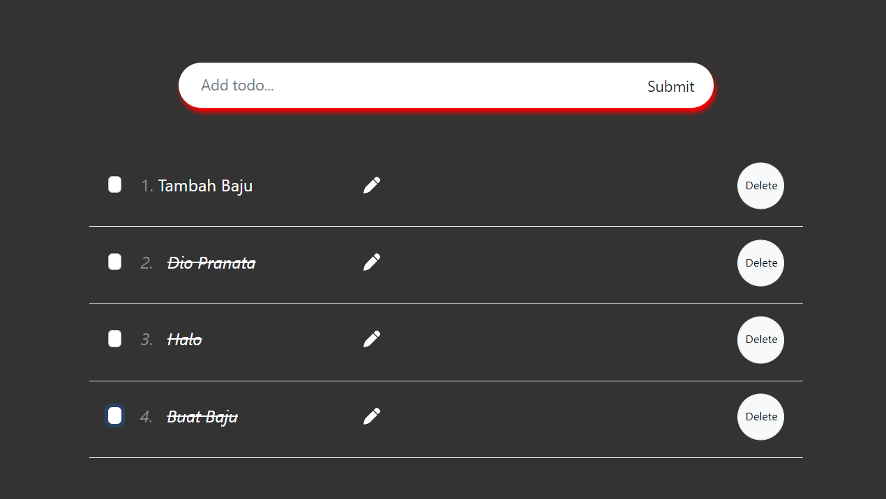

# Praktikum_Putu-Bagus-Dio
# React Global State Management, Fetch using REST

## Soal

### Gunakan lah hasura untuk membuat database dan juga Restfull API sehingga memiliki struktur data mirip dengan assignment todo-app.

## Jawab

### 1. Pada assigment sebelumnya, telah membuat sebuah todo app menggunakan hooks, dimana sudah disampaikan sebelumnya untuk penjelasan fitur dan source code nya. Untuk perbedaan kali ini, belum menambahkan redux dan redux persist, akan tetapi membuat store data dalam cloud database hasura, kemudian melakukan pembuatan schema dari sebuah REST API, dimana terdapat beberapa method yang nantinya digunakan sebagai sebuah Endpoint, untuk mengambil data. Berbeda dengan penggunaan hook sebelumnya, dimana initialstate berisikan data dari initialValue dengan dataValue sebagai variabel penampung, pada source code, penggunaan state, yaitu toDo dan setTodo adalah sebagai penampung dari const client, yang berisikan baseurl endpoint yang dituju, dan mengisinya mengunakan async function, dengan memberikan setToDo sebuah hasil respon dari axios berupa data yang sudah disimpan pada cloud db melalui hasura.

### 2. Kemudian pada input section dari user, menggunakan async function createTodo, dan state newTitle sebagai penammpung input title dari user, dengan deklarasi title : ''. Jika createTodo dijalankan, maka akan mengecek apakah newTitle.title masih kosong, jika masih kosong maka di haruskan untuk mengisi terlebih dahulu, jika tidak maka akan menjalankan await client dengan method post, dengan url dan title akan di isi dengan newTitle.title (var temp), dan mereturn sebuah alert berhasil, dilanjutkan dengan mereset state newTitle menjadi kosong, dan setelah itu akan menggunakan props untuk mereset Loading menjadi true, sehingga setelah user input berhasil, maka akan langsung otomatis mereset data yang sudah di inputkan. (untuk meng-assign value dari input user menjadi controller component, menggunakan fungsi onchange, dengan params e sebagai acuan bahwa value sedang dilakukan perubahan, kemudian value akan di assign menuju newTitle, melalui name dengan isi nya yaitu 'value').

### 3. Kemudian untuk menampilkan isi dari data yang sudah di input, harus menunggu terlebih dahulu perubahan dari Loading state, dimana menggunakan useeffect jika sebuha component tertentu mengalami perubahan, dalam kasus ini adalah Loading, maka akan menjalankan useEffect yang didalamnya berisikan async function getToDo, kemudian re-assign Loading menjadi false jika Loading masih true, dan getToDo sudah dijalankan. Jika sudah Loading sudah di set false, otomatis jika ingin melihat pembaruan dari data, harus mengulang kembali async function getToDo untuk mendapatkan data dari endpoint, maka dari itu diperlukan sebuah function yang dapat mengubah Loading menjadi true dan merender ulang data yang di tampilkan pada toDo, melalui props yang dikirimkan setelah user input dijalankan, menuju fungsi setReload.
(untuk pengaplikasian dari redux belum saya coba, jika sudah saya akan commit changes, terimakasih.)

## Berikut hasil dari source code tersebut. 

