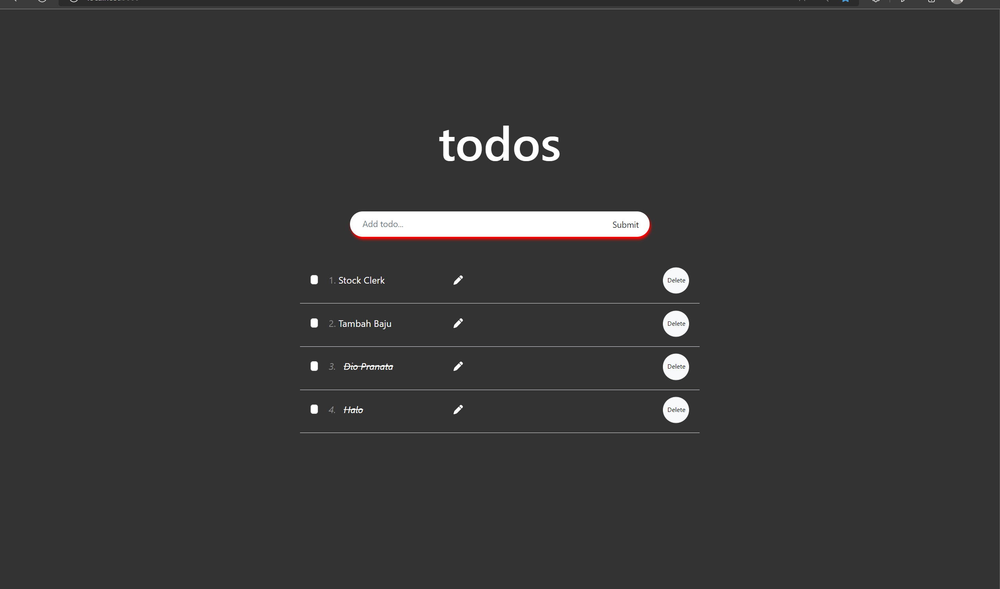
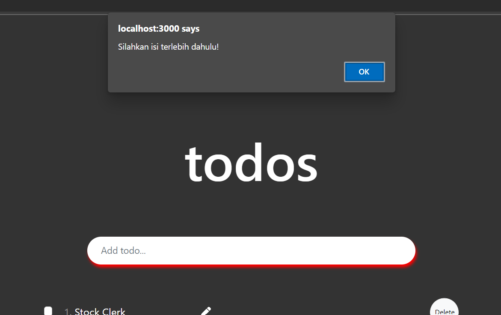
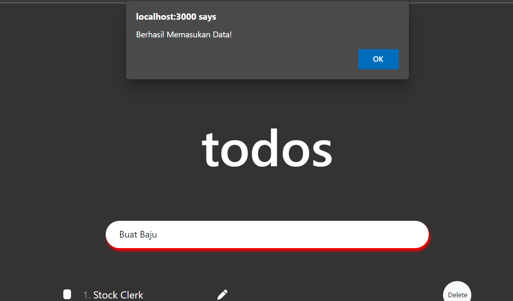
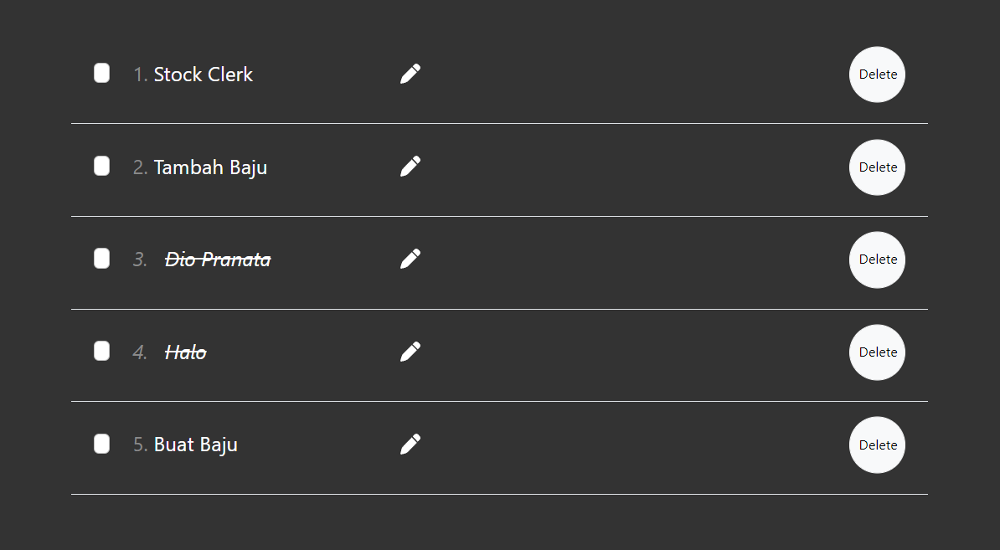
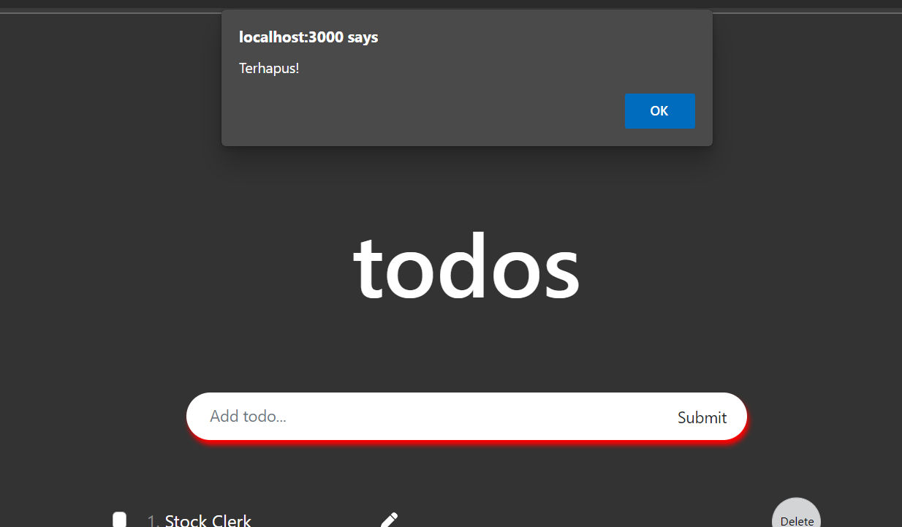
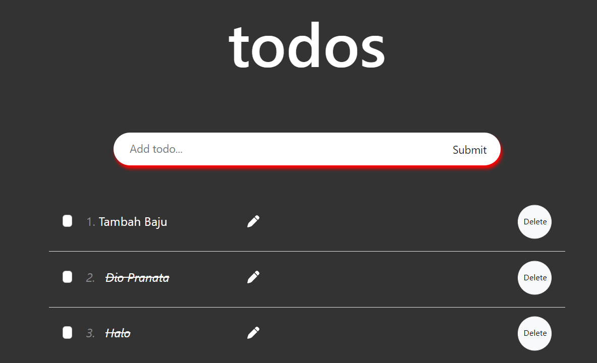
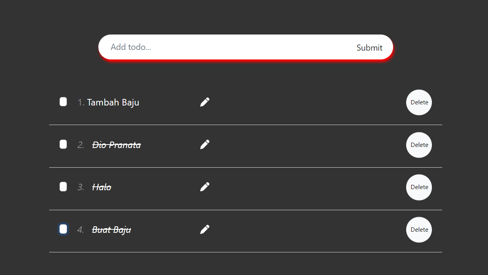

# React_Form

## Resume
Pada materi ini, mempelajari tentang beberapa hal berikut :
1. Pengenalan pada materi React Global State Management REDUX, dan Data Fetching Hasura
2. Bagaimana penggunaan React Redux, Store, Slice pada sebuah aplikasi yang berisikan input, kemudian Rest API menggunakan hasura dengan cloud db.
3. Peng-aplikasiannya pada sebuah aplikasi ToDo List.

### Penjelasan
1. Pada Materi ini, saya telah belajar banyak hal, terutama dalam hal managing state secara menyeluruh pada tiap komponen, kemudian bagaimana penggunaanya pada aplikasi simple ToDo list, lalu menampilkan nya. Kemudian penggunaan dari sebuah store, kemudian redux, yang membantu untuk membuat sebuah komponen lebih baik untuk di jalankan, kemudian lebih me-manage code dengan lebih rapih, meskipun belum menggunakan database seperti penggunaan hasura, kemudian fetch melalui endpoint. 

2. Kemudian dalam Rest API dan Hasura, kemudahan yang didapat pada pembuatan sebuah ujung penghubung dari sebuah database, menuju tampilan yang akan ditampilkan pada user, serta penggunaan dari state hook yang ada dalam mengambil serta memanage sebuah flow dari menampilkan isi dari data tersebut sangat lah membantu, saya belum banyak mengerti metode lain dalam penggunaan hooks ini, akan tetapi sangat terbantu dan seru untuk dipelajari.

## Task 

Hasil Task dapat dilihat pada .

