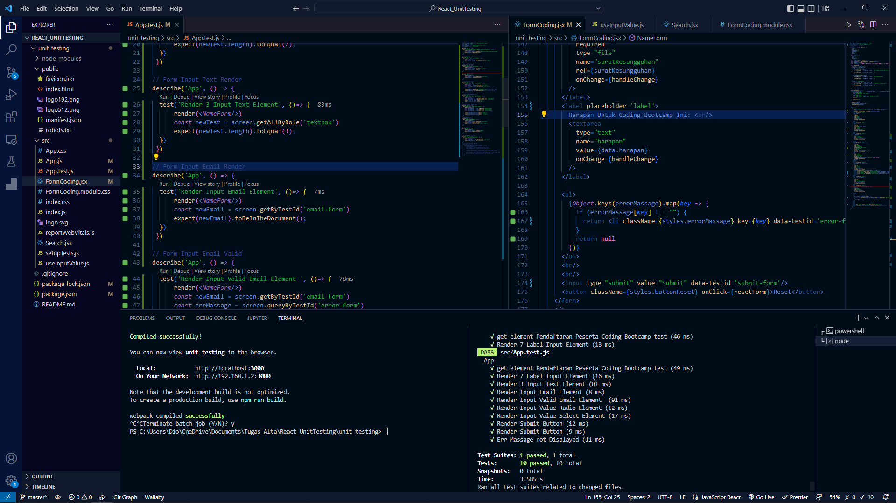
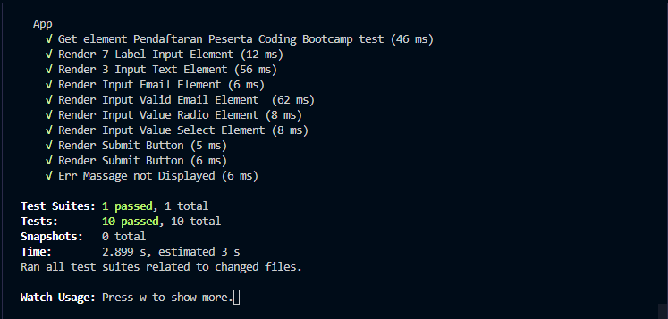
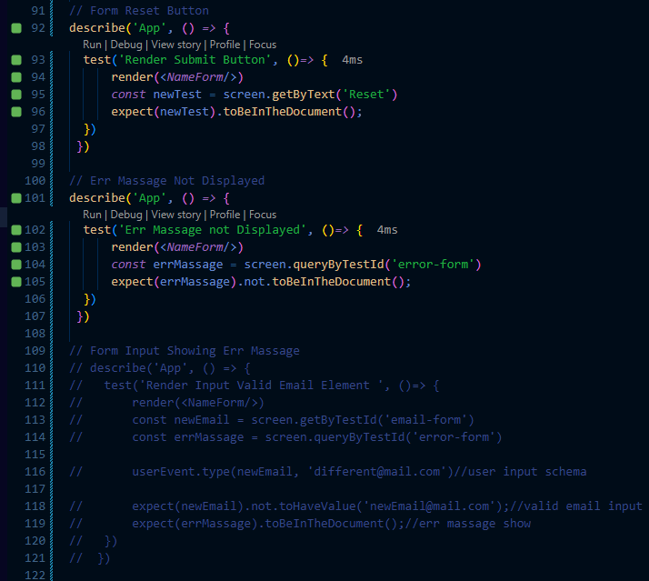

# React Testing

# React_Form

## Resume
Pada materi ini, mempelajari tentang beberapa hal berikut :
1. Pengenalan pada materi Testing pada aplikasi yang sudah ada.
2. Bagaimana menjalankan sebuah testing pada suatu aplikasi komponen, kemudian melihat apakah sesuai dengan apa yang di inginkan atau tidak. 
3. Serta mengetest sebuah komponen hook yang terdapat pada aplikasi.

### Penjelasan
1. Pada Materi ini, saya telah belajar banyak hal, terutama dalam hal testing komponen didalam sebuah aplikasi, dan kali ini pembuatan aplikasi sudah ada, dan diberikan langsung ke pada kami. Pada komponen NameForm, saya mengetes elemen seperti judul apakah berjalan dan dirender dengan baik, kemudian label input berjumlah 7, terdiri dari input text, kemudian radio, dan juga file

2. Kemudian akan dilanjutkan pada testing sebuah hook, dimana dalma sebuah komponen merender dan me-return sebuah hook value, yang diset melalui sebuah props, dan menggunakan renderHook method, dan mengharapkan return dari result.current.value, akan sama dengan isi dari props tersebut.

3. Dan terakhir untuk testing sebuah api endpoint, menggunakan sebuah jest mock, dan isi nya akan di test melalui sebuah loading, dimana jika loading berjalan dann bersifat true, maka akan menampilkan text content Loading, jika tidak, maka tidak menampilkan text content loading... .

### Hasil Task dapat dilihat pada .

