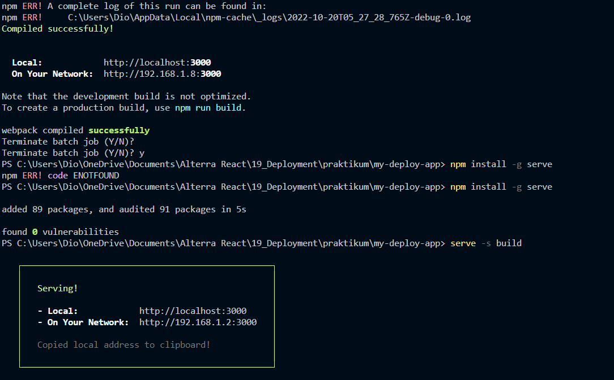
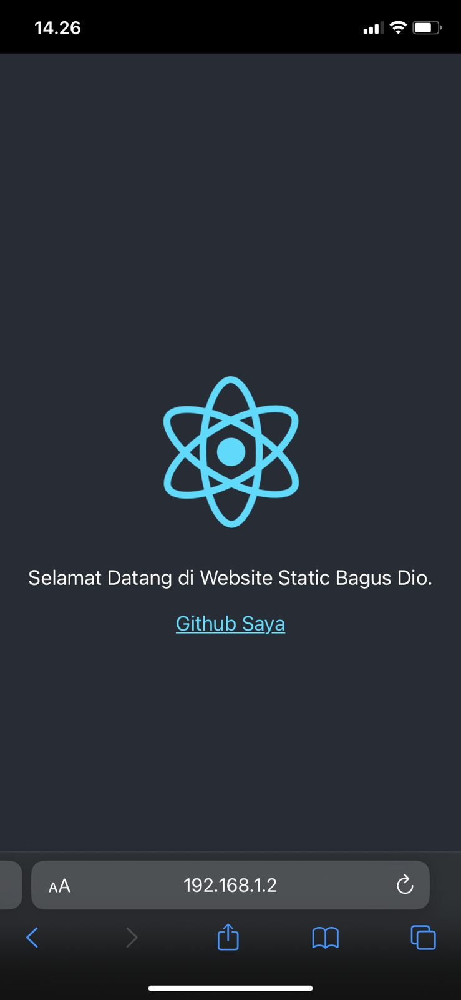

# React Deploy

## Resume
Pada materi ini, mempelajari tentang beberapa hal berikut :
1. Pengenalan pada materi Deploy Static web menggunakan surge atau netlify.
2. Bagaimana create build app folder dir, kemudian akan digunakan dalam deployment bukan lokal. 
3. Serta mendeploy sebuah website melalui cli, menggunakan cli melalui layanan pihak ke-3.

### Penjelasan
1. Pada Materi ini, saya telah belajar mengenai bagaimana mendeploy sebuah website atau aplikasi yang ada menggunakan layanan untuk deploy web, yaitu surge dan netlify.

2. Kemudian akan dilanjutkan pada compile sebuah build dir, guna untuk mendeploy kemudian secara local, maupun digunakan saat mendeploy aplikasi atau website tersebut secara utuh dan bisa diakses oleh orang lain.

3. Saya menggunakan netlify, dengan cara membuat dir build terlebih dahulu, masuk ke website netlify dan login, lakukan netlify login melalui cli, dan authentikasi untuk penggunaan cli, dan terakhir menjalankan netlify deploy, dan menjawab beberapa requirement yang dibutuhkan atau ingin dipilih untuk deploy, sesuai keinginan kita, seperti nama, dan lain nya.

### Hasil Task dapat dilihat pada .

