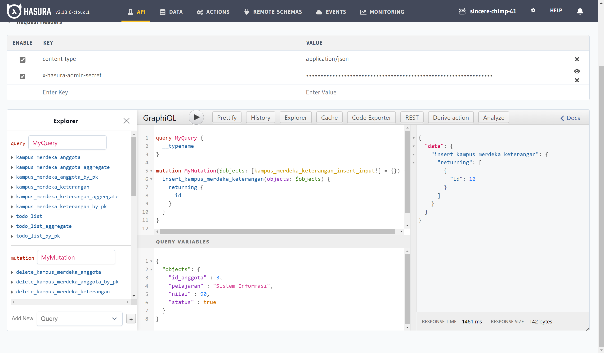
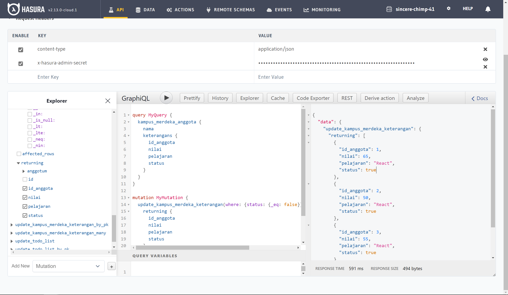

# Praktikum_Putu-Bagus-Dio
# GraphQl-Basic

## Soal
### 1. Masuk ke hasura dan buatlah sebuah database bernama kampus_merdeka
### 2. Buatlah table anggota yang berisikan id(primary key, auto increment) dan nama
### 3. Buatlah table keterangan yang berisikan id(primary key, auto increment) id_anggota, pelajaran, nilai, dan status (boolean)
### 4. Masukan 3 buah data pada tabel anggota

### :pen: 
********

|id | nama |
|---|---|
| 1 | Budi |
| 2 | Sita |
| 3 | Angga |  

### 5. Masukan data dibawah

### :pen: 
********

|id|id_anggota|pelajaran|nilai|status|
|---|---|---|---|---|
|1|1|Sistem Informasi|85|true|
|2|1|React|65|false|
|3|2|Sistem Informasi|90|true|
|4|2|React|50|false|

### 6. Lakukan query untuk memanggil hanya siswa yang memiliki status true
### 7. Lakukan insert kepada angga dengan menggunakan mutation sehingga memiliki data berikut.

### :pen: 
********

|id|id_anggota|pelajaran|nilai|status|
|---|---|---|---|---|
|5|3|Sistem Informasi|90|true|
|5|3|React|55|false|

### 8. Dengan menggunakan mutation lakukan update terhadap data yang memiliki nilai false menjadi true.

### Gunakan lah hasura untuk membuat database dan juga Restfull API sehingga memiliki struktur data mirip dengan assignment todo-app.

## Jawab

1. Langkah awal dalam pembuatan database adalah masuk ke hasura, kemudian login, dan konek menuju heroku, dilanjutan dengan membuat project, dan masuk ke project tersebut, lalu cari menu data, jika ingin koneksi dengan database lain bisa, jika tidak pilih posgree untuk database. Dilanjutkan dengan create schema, didalamnya akan terdapat tabel yang ingin dibuat, klik create tabel, dan masukan input sesuai jenis nya, seperti int, text/string, boolean, dan tidak lupa primary key pada id atau field lain. Kemudian tambahkan foreign key jika terdapat tabel yang ingin di relasikan, dan relasi tabel dapat berupa one to many, atau many to many.

2. Pada soal nomor 6, menggunakan query untuk menampilkan anggota atau siswa yang memiliki status true, jika terdapat status true pada tiap siswa, maka siswa tersebut akan dimunculkan, berupa id, nama, serta pelajaranya. Selanjutnya soal nomor 7, melakukan insert pada siswa yang bernama angga, dengan memasukan data menggunakan mutation insert pada keterangan, menyesuaikan anggota_id milik angga, karna relation tabel user dengan tabel keterangan ada pada id dan id_anggota. Dan disini saya melakukan 2 cara, dan cara ke dua adalah dengan memasukan object seperti biasa menggunakan insert mutation, kemudian dengan constrain key, dimana one_to_one_anggota id = 3, yaitu id anggota dari angga, maka insert akan mengacu pada id anggota yang sudah di relasikan sebelumnya (one_to_one).

3. Dan terakhir melakukan update menggunakan mutation, kemudian menggunakan status yang masih bersifat false akan diubah menjadi true, dan me-return id anggota, nilai, pelajaran, dan status.

## Berikut hasil dari source code tersebut. 
.png)
.png)

.png)
.png)
