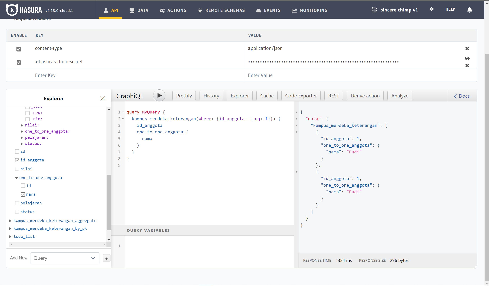
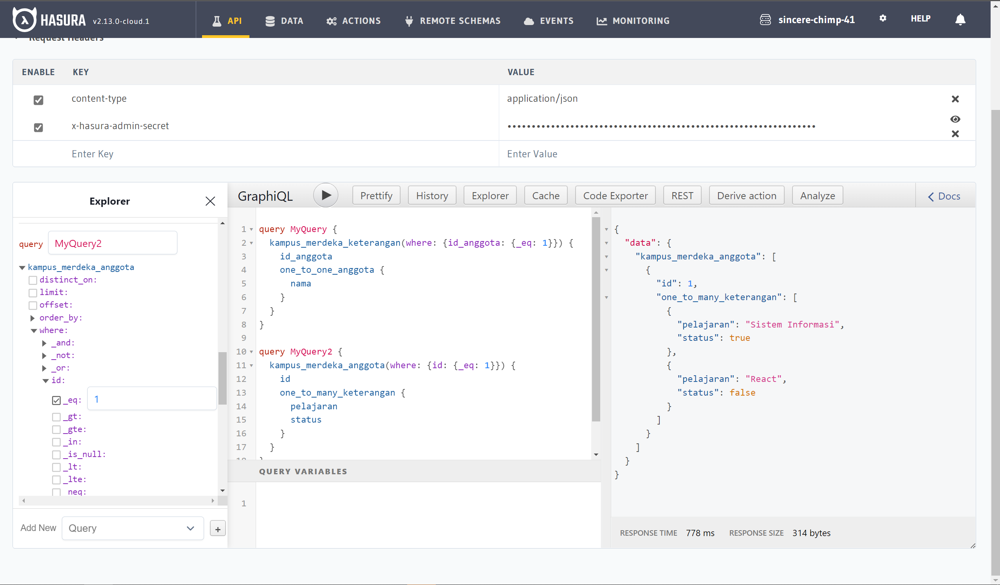

# Praktikum_Putu-Bagus-Dio
# Relation Database with Hasura

## Soal
1. Lakukan relasi database one to one, yang mana akan menghubungkan id_anggota pada tabel keterangan dengan nama pada tabel anggota.
2. Lakuakn relasi database one to many, yang mana akan menghubungkan id pada tabel anggota dengan pelajaran pada tabel keterangan.

## Jawab

1. Langkah awal dalam melakukan relasi pada sebuah data base, adalah dengan membuat sebuah database terlebih dahulu, kemudian di berikan primary key pada field, di tiap tabel, selanjutnya lakukan relation dari tabel yang ingin kita relasikan, kemudian pastikan relasi tersebut merupakan relasi one to one, dimana setiap pelajarn, anggota id, status pada tabel keterangan hanya akan memiliki 1 anggota, dengan id, dan nama nya masing - masing, dan perlu dipastikan harus melakukan sebuah relation menggunakan primary key atau uniqe key pada masing - masing tabel, minimal dari ke 2 tabel, salah satu harus berupa key, jika tidak, dipastikan jenis data yang di gunakan adalah sama jika ingin merelasikan ke 2 buah tabel tersebut, dengan cara manual.

2. Pada soal nomor 6, menggunakan query untuk menampilkan anggota atau siswa yang memiliki status true, jika terdapat status true pada tiap siswa, maka siswa tersebut akan dimunculkan, berupa id, nama, serta pelajaranya. Selanjutnya soal nomor 7, melakukan insert pada siswa yang bernama angga, dengan memasukan data menggunakan mutation insert pada keterangan, menyesuaikan anggota_id milik angga, karna relation tabel user dengan tabel keterangan ada pada id dan id_anggota.

## Berikut hasil dari source code tersebut. 

